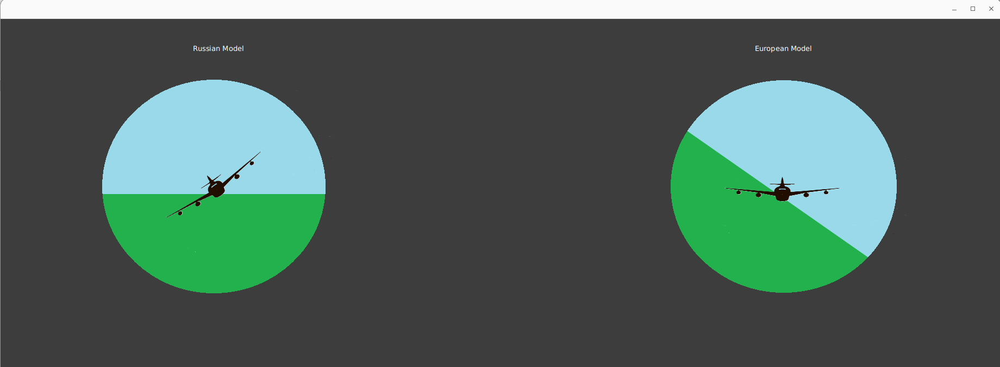

# Final Airplane Horizon Controller

The Final Airplane Horizon Controller project is a JavaFX application that simulates the movement and rotation of two airplane models – European and Russian – on a graphical user interface. This project provides a responsive and interactive interface for users to control the airplanes' movements and observe their rotations.

## Table of Contents

- [Project Overview](#project-overview)
- [Project Structure](#project-structure)
- [Dependencies](#dependencies)
- [Installation](#installation)
- [Usage](#usage)
- [Features](#features)
- [Preview](#preview)
- [Contributing](#contributing)
- [License](#license)

## Preview



## Project Overview

The primary goal of this project is to showcase the capabilities of JavaFX for creating engaging graphical user interfaces. The application features two airplane models: European and Russian, each with distinct characteristics. Users can interact with the application using keyboard controls to rotate and translate the airplanes within the graphical space.

## Project Structure

The project follows a modular structure with three main files:

- `App.java`: The main class responsible for launching the JavaFX application.
- `AirplaneController.java`: Manages the logic and control of the airplanes, including rotations and translations.
- `ImageViewUtils.java`: Contains utility methods for resizing and translating `ImageView` objects.

## Dependencies

The project relies on JavaFX for building the graphical user interface. Ensure that you have JavaFX libraries properly configured in your classpath. This project is developed using Java and compatible with Java 8 and later.

## Installation

1. Clone the repository:

   ```bash
   git clone https://github.com/ayoubkassi/final-airplane.git
   ```

2. Open the project in your preferred Java IDE.

3. Configure the JavaFX libraries in your project.

4. Build and run the `App.java` file.

## Usage

The application provides a straightforward user interface for controlling the airplanes. Utilize the keyboard arrow keys to rotate and translate the airplanes in different directions. Observe the real-time changes in the graphical space as you interact with the application.

## Features

- **Two Airplane Models:** Choose between European and Russian airplane models, each with unique characteristics and appearances.

- **Responsive Controls:** Use intuitive keyboard controls to rotate and translate the airplanes, providing a dynamic and interactive experience.

- **Graphical Interface:** The graphical user interface offers a visually appealing representation of the airplanes within a horizon controller.

## Contributing

We welcome contributions! Feel free to fork the repository, make improvements, and submit pull requests. If you encounter issues or have ideas for enhancements, please open an issue.

## License

This project is licensed under the [MIT License](LICENSE).
